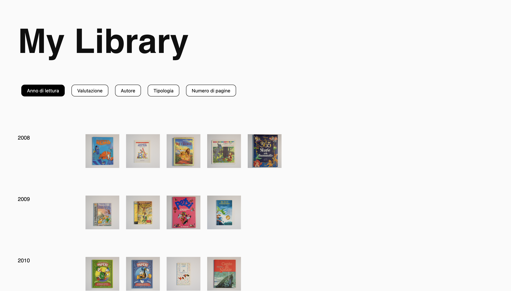

SUPSI 20223-24  
Corso d’interaction design, CV428.01  
Docenti: A. Gysin, G. Profeta  

Elaborato 1: XS 

# My Library
Autore: Roberta Valli  
[My Library](https://github.com/robertavallii/my_library)


## Introduzione e tema
My Library è una biblioteca digitale pensata per conservare e valorizzare la mia personale collezione di libri letti. Attraverso un'interfaccia intuitiva, il progetto offre una visione dettagliata della mia raccolta, compresi la distribuzione annuale dei libri, gli autori più apprezzati, la tipologia di libri letti e la valutazione di ogni libro.


## Riferimenti progettuali
Per la realizzazione di questo progetto, non ho seguito references, ma mi sono focalizzata sull'individuare il modo ottimale per rappresentare la mia collezione e per visualizzare i dati relativi alla ricerca.

## Design dell’interfraccia e modalià di interazione
L'interfaccia di My Library consente agli utenti di visualizzare i libri letti in base a diversi criteri come l'anno di lettura, il gradimento, l'autore e la tipologia di libri. Il sito è sviluppato come un'unica pagina con il titolo del progetto nell'header e i bottoni posti immediatamente sotto per la selezione dei criteri di visualizzazione. La griglia di visualizzazione dei dati mantiene una disposizione costante, con i dati numerici e i metadati posizionati nella colonna di sinistra e le immagini dei libri disposte uniformemente.

[]()


## Tecnologia usata
Il sito è strutturato secondo una griglia dinamica che si adatta alle selezioni dell'utente. Per costruire e aggiornare questa griglia, è stata implementata la funzione buildHTML. Essenziale per la costruzione dinamica della griglia dei dati, questa funzione inizia determinando la categoria da utilizzare per la visualizzazione dei dati, che può essere "autore", "anno di lettura", "tipologia" o "gradimento". Successivamente, elabora i dati in base a questa categoria, identificando i valori unici e contando quante volte ciascun valore appare nei dati. Questo è particolarmente importante quando la categoria selezionata è "autore" o "tipologia". Infine, buildHTML crea il codice HTML per la griglia, iterando sui valori unici e generando blocchi di codice HTML per ciascuno di essi, inclusi i libri corrispondenti. Questo codice HTML viene quindi inserito nell'elemento con la classe ".grid-container", aggiornando così dinamicamente la visualizzazione dei dati sulla pagina web.

```
// Funzione per costruire il codice HTML in base ai dati
    const buildHTML = () => {
        let category;
        if (useAuthor) {
            category = "autore";
        } else if (useYear) {
            category = "anno_lettura";
        } else if (useType) {
            category = "tipologia";
        } else {
            category = "gradimento";
        }

        let uniqueValues; //per contare quante volte vede un dato
        if (useAuthor || useType) {
            const categoryCounts = data.reduce((counts, book) => {
                const categoryValue = book[category];
                counts[categoryValue] = (counts[categoryValue] || 0) + 1;
                return counts;
            }, {});

            uniqueValues = Object.keys(categoryCounts).sort((a, b) => categoryCounts[b] - categoryCounts[a]);
        } else {
            uniqueValues = Array.from(new Set(data.map(item => item[category]))).sort((a, b) => a - b);
        }

        let gridHTML = "";
        uniqueValues.forEach(value => {
            const filteredBooks = data.filter(item => item[category] === value);
            let booksHTML = "";
            filteredBooks.forEach((book, index) => {
                const imagePath = "assets/image/" + book.nome_file + ".png";
                booksHTML += `<div class="foto"></div>`;
            });
            gridHTML += `<div class="foto-column"><div class="anno">${value}</div><div class="foto-container">${booksHTML}</div></div>`;
        });

        document.querySelector('.grid-container').innerHTML = gridHTML;
    };

```

Un aspetto cruciale del mio progetto è la gestione dei bottoni, i quali permettono agli utenti di selezionare diverse modalità di visualizzazione dei dati. Ogni bottone, come "Visualizza per Anno", "Visualizza per Autore", ecc., è associato a un evento di clic. Quando viene cliccato, attiva una funzione corrispondente che imposta le variabili di stato useYear, useAuthor, useType su true o false in base alla modalità selezionata. Ad esempio, se l'utente clicca sul bottone "Visualizza per Anno", useYear diventa true e useAuthor e useType diventano false. Queste variabili di stato influenzano il comportamento della funzione buildHTML, che aggiorna dinamicamente la griglia dei dati in base alle nuove impostazioni di visualizzazione. Inoltre, è stato implementato un evento di clic anche sulle immagini, consentendo agli utenti di interagire con esse in modo dinamico.


```
  // Aggiungi un event listener per il clic sull'immagine
    document.querySelectorAll('.foto img').forEach(image => {
        image.addEventListener('click', handleImageClick);
    });

    // Gestisci il click sul bottone "Visualizza per Anno"
    document.getElementById('yearButton').addEventListener('click', () => {
        useYear = true; // Imposta il flag su true (visualizza per anno)
        useAuthor = false; // Imposta il flag su false (non visualizzare per autore)
        useType = false; // Imposta il flag su false (non visualizzare per tipologia)
        buildHTML(); // Ricostruisci il codice HTML
    });
```


## Target e contesto d’uso
Il target di My Library è l'utente singolo che desidera gestire in modo accurato la propria collezione personale di libri letti.Inoltre, questa piattaforma potrebbe interessare a chi desidera conoscere meglio le abitudini di lettura dell'utente, fornendo un'anteprima dei libri che legge e delle preferenze letterarie. Un possibile sviluppo futuro del progetto potrebbe includere la possibilità per l'utente di aggiungere manualmente i libri letti, trasformando l'applicazione in un'interfaccia completa per la gestione e l'arricchimento della propria biblioteca digitale personale.
